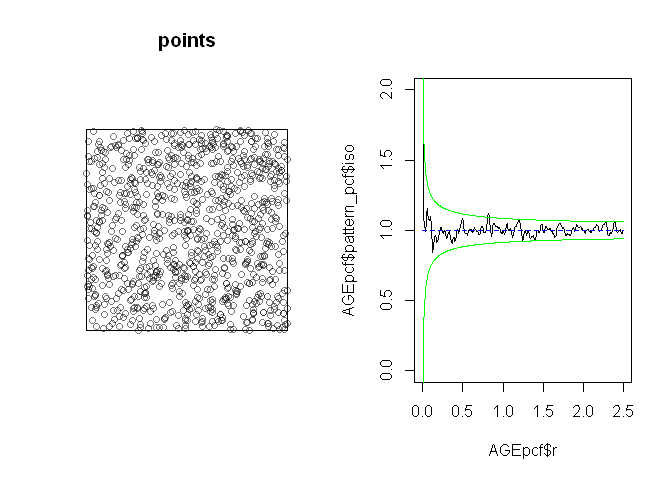
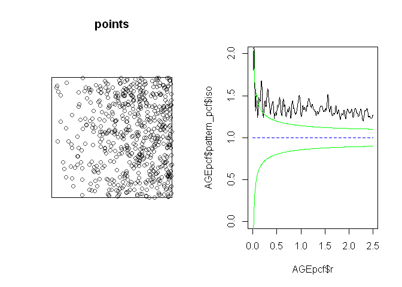

Phil McDowall
September 16, 2016

Homogeneous poisson point process
---------------------------------

``` r
points = spatstat::rpoispp(10,win=owin(xrange=c(0,10),yrange=c(0,10)))
pcf_points = AGEpcfPp(points,alpha=0.05,bw=0.01)
par(mfrow=c(1,2))
plot(points)
plot(pcf_points)
```

<!-- -->

``` r
pcf_points$p
```

    ## [1] 0.9990582

Inhomogeneous poisson point process
-----------------------------------

``` r
points = spatstat::rpoispp(lambda=function(x,y){x^1.1},win=owin(xrange=c(0,10),yrange=c(0,10)))
pcf_points = AGEpcfPp(points,alpha=0.05,bw=0.01)
par(mfrow=c(1,2))
plot(points)
plot(pcf_points)
```

<!-- -->

``` r
pcf_points$p
```

    ## [1] 0
